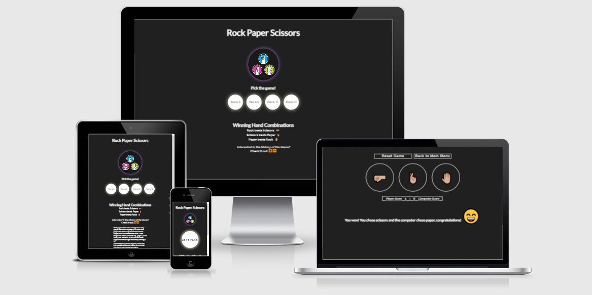

<h1 align = "center">Rock Paper Scissors</h1>

View the live project at the following [link](https://aryan008.github.io/gameshow-m1/).

As per [Wikipedia](https://en.wikipedia.org/wiki/Rock_paper_scissors), “Rock paper scissors is a hand game usually played between two people, in which each player simultaneously forms one of three shapes with an outstretched hand. These shapes are "rock" (a closed fist), "paper" (a flat hand), and "scissors". It is one of the first games we learn to play growing up, and I have fond memories playing in it in the Schoolyard and with my Family. Hence, the creation of this game using HTML, CSS & JavaScript will allow me to develop my skills.

The aim of this site is to allow the user of the site to participate in this game online. Users will experience:
*	a welcome/rules page where the user can pick the “best of X” games to play
*	a loading page
*	a playing page where they can participate in the Rock, Paper, Scissors (“RPS” hereafter) game against the “computer”
*	instant feedback whether they won, lost or drew the hand played
*	to see if they are winning/losing/drawing by following their score against the “computer”
*	an overall winner/loser of the game

The site is designed to be responsive and accessible across all device sizes, as defined in the testing section of this ReadMe file.
The site is also designed on a “single” webpage. However, the user interaction by virtue of “clicks” on buttons will allow the site user to experience different elements of the same page through the use of JavaScript.

## Table of Contents
* [Site Owner and Product/Business Goals](#site-owner-and-productbusiness-goals)
* [Developer goals](#developer-goals)
* [First Time Visitor Goals](#first-time-visitor-goals)
* [Returning and Frequent Visitor Goals](#returning-and-frequent-visitor-goals)
* [Basic Rules of Game](#basic-rules)
* [User Experience (UX)](#user-experience-ux)
  * *The 5 planes of User Experience – Decisions and Reasons*
   1.	[Strategy plane](#strategy-plane)
   2.	[Scope plane](#scope-plane)
   3.	[Structure plane](#structure-plane)
   4.	[Skeleton plane](#skeleton-plane)
   5.	[Surface plane](#surface-plane)
   
  *	[Who/ What/ How](#who-what-how)
  *	[User stories](#user-stories)

* [Design Features](#design-features)
  1.  [Wireframes](#wireframes)
  2.	[Typography](#typography)
  3.	[Colour scheme](#colour-scheme)
  4.	[Imagery](#imagery)
  5.	[Visual Hierarchy](#visual-hierarchy)
  6.	[Features implemented](#features-implemented)
  7.	[Features left to implement](#features-left-to-implement)

* [Design & UX – How do they come together?](#design--ux--how-do-they-come-together)
  * [User goals](#user-goals)
  * [Site owner goals](#site-owner-goals)
  * [Designer goals](#designer-goals)

* [Information Architecture?](#information-architecture)
  * [Sections](#sections)
  * [How CSS created an experience](#css-experience)
  * [How JS created an experience](#js-experience)
  * [Game Logic and Game Logic diagram](#game-logic-diagram)

* [Technology and Languages used](#technology-and-languages-used)
  *	[Languages](#languages)
  *	[Frameworks, Libraries and Programmes](#frameworks-libraries-and-programmes)

* [Testing](#testing)
  * [Code validation](#code-validation)
  * [Accessibility testing](#accessibility-testing)
  * [Responsive testing](#responsive-testing)
  * [Manual testing](#manual-testing)
  * [Further testing](#further-testing)
  * [Testing user stories from User Experience (UX) section](#testing-user-stories-from-user-experience-ux-section)
  * [Known bugs](#known-bugs)

* [Deployment](#deployment)
  * [Process of deployment](#process-of-deployment)
  * [How to run this project locally](#how-to-run-this-project-locally)

* [Credits](#credits)
  * [Content](#content)
  * [Media](#media)
  * [Code](#code)
  * [Acknowledgements](#acknowledgements)

## Site Owner and Product/Business Goals
As the site owner, the website is to act as the site for all users to play RPS, allowing them to:
* See the details of the history of the game
*	Start/Reset a game of RPS easily with no backward navigation for the user
*	Play RPS as a game
*	Understand the winning hand combinations
*	Visually see if they are beating the computer via a scoreboard
*	Get instant feedback if they won/lost/drew a hand
*	Have an overall winner/loser

The site is to achieve the following goals:
1.	The site is presented in an efficient and authentic way so that the users can quickly start a new game of RPS
2.	The information on the site is displayed clearly and contain all the information necessary for the user to understand the rules of the game and its history
3.	Provide feedback to the players on the result of each hand but also on an overall score basis
4.	Is responsive on all device sizes
5.	Utilize JavaScript to create a user-friendly experience
6.	Creates a positive experience for the user using colour, imagery and layout
7.	To display the content in a culturally appropriate attested to the audience it is aimed at

## Developer goals
As the developer, the site is to achieve the following goals:
1.	Mar the goals of the site owner and user together
2.	Create a positive experience for both parties using the specifications required by both parties
3.	Achieve responsive design across all devices
4.	Utilize the combination of HTML, CSS & JavaScript to enhance the experience of the user and site owner

## First-Time Visitor Goals
As a first-time visitor of the site, I want:

1.	My impression of the site to be a positive experience
2.	To understand the main purpose of the site
3.	To provide relevant content related to RPS – how to play, the history of the game, etc.
4.	A clear and unambiguous layout
5.	An instant feedback loop of the result of each hand against the computer
6.	Easy navigation of the site
7.	The ability to reset my score and start a new game
8.	To understand the score on the site clearly to see if I am winning
9.	The colours, layout and feel of the site to be of a gaming nature as part of cultural appropriation
10.	To pick a “best of X” games to play and there be an overall winner

## Returning and Frequent Visitor Goals
1.	A user-friendly format of playing RPS
2.	To explore the history of this game

## Basic Rules of The Game
The following are the simple rules of RPS:

1.	Rock beats Scissors
2.	Scissors beats Paper
3.	Paper beats Rock

## User Experience (UX)
### _The 5 planes of User Experience – Decisions and Reasons_
#### Strategy Plane

Question |	Response for site design
-------- | ---------
Is the content culturally appropriate? |	Design will be simplistic in terms of UX – Simple game simple design
Is the content relevant? |	Acting as a game, only relevant RPS content will be displayed
Can we provide content in an intuitive way? |	The site will have a series of buttons and, using JavaScript, will feel interactive to the site user
Is the technology appropriate? |	Since RPS is a rules-based game, a combination of CSS and JavaScript will be used for applicable user experience
Who is my target audience? |	People who are interested in learning about RPS and/or want to play the game
Product considerations |	No overload of content/imagery on the site - as per appropriation, RPS is a simple rules-based game and hence the content should reflect that. Allow clear feedback loops on the result of each hand played and an overall winner. Navigation/layout must be easy across all devices for the users.

##### Strategy feasibility scoping
Opportunity |	Importance |	Feasibility
-------- | --------- | -----------
Have a scoreboard for the Player vs CPU score |	5 |	5
Display the images of what the RPS hands look like in real life |	4 |	5
Seamlessly move the page when the user “clicks” the button |	5 |	5
Feedback loops on win/lose/draw – colour/text |	5 |	5
Instructions on how to play |	4 |	5
History of the game |	3 |	4
Setting a score that you “Win” the overall game |	3 |	3
Highest score achieved playing this game |	2 |	3
Have movable images for each hand - similar to a hand movement |	3 |	1
Insert audio for each hand played |	3 |	4
Two independent people playing against each other |	2 |	1

#### Scope Plane
What's in? |	What's out?
-------- | ---------
Player vs Computer scoreboard incrementation |	Two independent players to play against each other
Images as buttons that the user can select to choose their hand |	Highest score achieved whilst playing
Use of JavaScript to move between site stages i.e. from landing on the page to playing a game |	Moveable images on each hand similar to real life
Feedback loops on results	
Instructions on how to play/ winning hand combinations	
History of the game	
“First to X” – overall game winning score	
Audio for each hand played	
Allow the user to specify how many hands counts as a “Win” – i.e. who wins the game overall?	
Moveable images for each hand – using button animation	

#### Structure Plane
Question |	Response for site design
-------- | ---------
How do I navigate easily? |	Pre-game: Clicking on the allocated buttons (game number choice & Lets Play). During game: New game/reset button and back to main menu button 
How is the information presented? |	Using gaming style colours/features and minimal text content that allow the user to achieve their goals. Dark background to light interface for a clear separation of colours to the users. Clear feedback on the result of each hand played. The buttons on the landing page have glow affects, enticing the users to click on them.
State changes |	When the user clicks the number of games they want to play, JavaScript is used to display the “Let’s Play” button (this is often used in gaming as a 2nd state change). When the user clicks “Let’s Play”, JavaScript is used to start the game via a loading screen. There is a clear state change at the end of each hand through various JavaScript functions – colour change, scoreboard incrementing, etc. An overall winner/loser section takes over the entire screen once the user/computer reaches the specified number of wins.
Is the site consistent? |	Correct styling and fonts are applied throughout the site. Colour flashing on the scoreboard and buttons on the end of each round of hands is kept consistent.
Is the site predictable? |	After each “page” change from the use of JavaScript, the resulting “page” is familiar to the user in terms of font/styling consistency.
Is the site appropriately visible? |	See the testing/visual hierarchy section of this ReadMe file for visibility testing.
How does the user know to scroll/what to do? |	The buttons used to both progress through the site and play the game are adequately displayed and clear for the user to complete the necessary steps.
How does the user know if they are winning? |	The scoreboard will increment to either the user or the computer at the completion of each hand. Additionally, both the button hand chosen and the scoreboard will flash according to the result of the hand (Green is win, yellow is draw, red is lose). Further, text is displayed below the scoreboard on each hand showing both what the user clicked and what the computer chose. After the “first to X games won”, a state change will be made to the user detailing Congratulations/Commiserations on an overall game basis along with a trophy.
User error – what if it happens? |	Providing information to the user if this happens, and how to safely navigate back to the home page.
Information architecture |	Using the tree structure with no more than 3 clicks for the user to reach a destination.

#### Skeleton Plane
Question |	Response for site design
-------- | ---------
How will the users get around? |	Easy navigation for the user using call to action buttons pre-game and buttoned links during the game. The users can reset the game from the game page itself, as well as navigating back to the main menu by clicking on a button.
How will I present the content? |	Following industry norms of the header -> content -> footer approach across all pages.
How do I show relevant content? |	By making the content audience appropriate as defined by the site user goals. By using representational icons which the user is familiar with from playing RPS.
How do I make the experience a positive one? |	As defined in the strategy plane, following the simple game simple design approach. Through listening to the user goals, the content on the webpage is simplistic to avoid over-information. Use of JavaScript will allow seamless transitions from the landing page to playing the game. The cursor pointer and various text transition effects will be involved in producing a further positive response from the user. The state changes noted in the structure plane also discuss key colour effects on the result of each hand played.
How do I structure the features and usability? |	Pre-game: Simple text in a block followed by a call to action for the user to click how many games they’d like to play, followed by a CTA Let’s play button. During game: 1.	Scoreboard feature 2.	Navigation/reset buttons 3.	Clear buttons to click for the user to play the game 4.	Feedback using text/colouring on the result of each hand 5.	Overall feedback on the winner/loser on a total basis 6.	Sounds associated with RPS

#### Surface Plane
Question |	Response for site design
-------- | ---------
What is the visual language? |	Colouring as per testing norms, layout is sparse but informative, Fonts as per media display standard, images are clear and pop to the user, JavaScript for call to action for the user to progress from landing page to the game
What is the economy? |	The most important user/owner elements are easily recognised
Readability and consistency |	After each “page” change from the use of JavaScript, the resulting “page” is familiar to the user in terms of font/styling consistency

### _Who/ What/ How_
**Who is it for?** Users who want to understand RPS and its rules, its history and play a game

**What is it for?** Users who wish to play a game against the computer online

**How will it achieve this?** Through creating a RPS site, and through JavaScript, allow the user to compete against a computer opponent for a “best of X” series

### _User Stories_
RPS is one of the earliest games I ever played as a child. A simple, rules based logical game that can be both incredibly fun and lead to bragging rights for a brief time. Often, RPS is a “toss a coin” moment, something two people do to decide on an action.

Hence, I want a site where I can:
1.	Play RPS against a computer
2.	Learn about the history of RPS
3.	Navigate easily
4.	See if I’m winning or not
5.	Not become overburdened by information – this is a simple game

#### Wireframes
* Desktop wireframe - [attached](assets/rm_files/wireframe-desktop.pdf)
* Tablet wireframe - [attached](assets/rm_files/wireframe-tablet.pdf)
* Mobile wireframe - [attached](assets/rm_files/wireframe-mobile.pdf)

#### Typography
Lato is used as the main font on the site, as imported through Google Fonts. Sans-serif is used as the fallback font. According to an article on [perpetual media group](http://www.perpetualmediagroup.ca/tenbestfontsforprintandweb/):
“The semi-rounded details of the letters give Lato a feeling of warmth, while the strong structure provides stability and seriousness.”

Further, in this [blog post](https://www.justinmind.com/blog/best-google-web-fonts-website/), Lato is ranked as #1 on the “30 best Google Fonts for your website”. It is known that the designer of this font, Lukasz Dziedzic, “created Lato to work transparently in body text and also to stand out individually when used in larger-sized titles”.
With these descriptions in mind, Lato is used for the game design/accompanying text.

#### Colour Scheme
The main colours used on the site are a shade of black and white:
* Background: rgb(32, 32, 32) (black)
* Text colour: rgb(255,255,255) (white)
The reason for this is to achieve a “pop” effect on the icons and text presented, making them appeal more to the screen reader. 

According to [designwebkit](https://designwebkit.com/design/gaming-website-templates-professional-tips-build-game-website/#:~:text=As%20you%20may%20notice%2C%20most,brown%2C%20grey%2C%20and%20khaki.):

_“Most popular gaming websites use dark colour scheme for their websites to create a mystic and engaging ambiance. The most popular colours for such websites are black, brown, grey, and khaki”._

Further colourings used on the site:
* Href links on the hover: rgb(43, 107, 226) (slate blue as per norms)
* Box-shadow opacity on both the hero image and vector spinning image of 0.877 (dark purple for gaming feel)
* Box-shadow opacity on both the game choice buttons and Let’s Play button of 0.877 (contrast white for user CTA)

Flash colourings added on a win/draw/loss to the scoreboard:
* Win - rgb(49, 245, 31) (Green)
* Loss - rgb(226, 77, 77) (Red)
* Draw - rgb(255, 255, 0) (Yellow)
* 
Flash colourings added on a win/draw/loss to the game buttons of rock/paper/scissors:
* Win - rgb(49, 245, 31) (Green)
* Loss - rgb(226, 77, 77) (Red)
* Draw - rgb(255, 255, 0) (Yellow)

Keyframes were applied to all colourings here to add a scale animation to the button the class affected by it. The keyframes had a 1.5s ease-in-out timing function and went from scale 1.05->0.95->1.
Documentation on the help with the implementation of these keyframe features are sourced [here](https://css-tricks.com/almanac/properties/a/animation/---*/).

#### Imagery
On the landing page, a hero image is displayed as a vector icon of the RPS game. CSS is used to add a coin-flip effect to this picture, as RPS is a game of chance.
On the loading page, a similar vector image is displayed and rotates in a circular 360degree manner. The help for creation of this flip is sourced at [this Stack Overflow post](https://stackoverflow.com/questions/10123700/how-to-make-a-picture-rotate-continuously).
A loading gif is also created during the loading page, which was created from scratch on spinner.io to match the background colour perfectly.
The site uses three separate images during the playing of the game in the button hand choices. These images correspond to the Rock/Paper/Scissor icons that are associated with the game; hence they will be familiar to the user. 
The use of emoji’s – either smiley faces or trophy – are displayed throughout the site as a form of feedback loop to the user on each hand.
Font Awesome is used to display emoticons on the landing page.
See the credits section of this ReadMe file for all appropriate accreditation of the imagery used.

#### Visual Hierarchy
According to the following article on [Visual Hierarchy](https://www.interaction-design.org/literature/topics/visual-hierarchy):

“Visual hierarchy controls the delivery of the experience. If you have a hard time figuring out where to look on a page, it’s more than likely that its layout is missing a clear visual hierarchy.”

The following characteristics per the article are manipulated (__article narrative in bold__, _developer response in italic_):
* __Size – Users notice larger elements more easily.__ _The three images of Rock/Paper/Scissors will be large and act as buttons to play the game with, allowing instant notice by the user. The 4 game number choices available to the user will be slightly smaller than the CTA of “Let’s Play” to start the game, highlighting that the click of the “Let’s Play” button is the final step before the game starts._
* __Colour – Bright colours typically attract more attention than muted ones.__ _The contrast between the dark background and bright text attracts the user the read the text more visibly. Colour classes are added at the end of each hand to visibly display to the user whether they won, lost or drew the hand. See the testing section of this file for contrast testing._
* __Contrast – Dramatically contrasted colours are more eye-catching.__ _As noted above._
* __Repetition – Repeating styles can suggest content is related.__ _The style is repetitive – information for the user follows the same pattern after each “click” by the user._
*	__Proximity – Closely placed elements seem related.__ _Content is grouped based on spacing for user readability sectioning. The grouping of the game number choice buttons are placed beside each other as these are the options, before making way to the singular “Let’s play” button. The grouping of the three images draws the users into the fact that these are the suggested icons to click on to play the game. The scoreboard is noted below the buttons – this is a design choice seen in most gaming circles._
*	__Whitespace – More space around elements draws the eye towards them.__ _Spacing is used effectively according to the hub needs of the product goals._
*	__Texture and Style – Richer textures stand out over flat ones.__ _As noted in the typography section._

#### Features implemented
##### Welcoming Page
*	The site landing/welcoming page welcomes the user to the RPS game, demonstrating that RPS is the outcome of the site
*	The navigation displays a “call to action” for the user to click to start the process of playing the game after selecting the number of “best of” games to be played
*	There is a clear state change once the user clicks the “Let’s Play” button

##### Loading Page
*	The loading page displays a loading gif as well as a spinning image of RPS
*	Text is displayed the user that the game is loading
*	The loading page acts as a bridge between user input and the gameplay – which is highly common in gaming

##### Game Page
*	The “New Game/Reset” and “Back to Main Menu” buttons allow seamless navigation of the user through the site
*	On a win, the border of your chosen hand goes green momentarily. If you lose, it goes red. If you draw, it goes yellow – applied to the scoreboard also
*	Audio of “rock, paper, scissors, shoot” is heard at the start of each hand once the button is chosen
*	After the “first to X” wins, a state change occurs with a section that you won/lost is given to the user and the score is automatically reset to zero
*	An incrementing scoreboard is present to the user

##### Bespoke Styling Features - Transitions
*	Throughout the site, the mouse pointer changes to cursor when it is hovered over any clickable element for the user to interact with
*	On the welcoming page, there is a transition size effect on the user’s call to action buttons
*	On the welcoming page, there is a transition colour effect on the user’s call to action buttons
*	The colour change to the scoreboard/buttons has a show/hide effect – only present for one second
*	Once the game number/Let’s play/Main menu buttons are chose, a fade effect comes in to display the relevant content to the user

##### Colours & Fonts
*	Background colour is set using a dark style as noted in the colour section, displaying a gaming approach feel to the user
*	Font colour is set in contrast to the background. This gives the effect of user-friendly-readability and gives the “pop” sensation of text overlapping the dark background
*	Lato is used as the playful text of choice for the site, providing a sense of warmth to the user, while the strong structure provides stability and seriousness.

##### Layout
*	The site’s page is structured visually (font/colouring/areas) consistently throughout after each click by the user, creating a common theme for the site. The hierarchy presented tells the user extremely quickly where to look on a page, where to click and how to navigate the playing of the game.

##### Game interactive buttons
*	Allows the user to select the “best of X” games to play against the computer, which carries through to the playing of the game
*	The “Let’s Play” button signifies that the game is to start very shortly as the loading page beings
*	The reset/main menu buttons provide a clear CTA to the user
*	The rock/paper/scissors buttons used for gameplay have an unambiguous size/style to pop to the user to click on one of them to play the game 

##### In game audio
*	Audio is played at the beginning of every hand (“Rock, Paper, Scissors, Shoot!”) as well as at the end of the overall game – either playing a “winning” sound or “losing” sound as appropriate.

#### Features left to implement
*	The ability for two independent players to play against each other on different devices
*	Have a “save progress” function, whereby the user can see their highest score achieved whilst playing against the computer
*	Have the images on the screen move up/down similar to real life at the beginning of each hand

## Design & UX – How do they come together?

### User goals

User Goal | Feature(s)/ Content in response | Goal Met?
-------- | --------- | --------
(1)|	Colour/Font/Layout structure. Responsive button elements. Clear call to action.|	Yes
(2)|	RPS displayed on initial landing page.|	Yes
(3)|	Once the user clicks the game button “Let’s play”, content is presented to the user via a JavaScript state change.|	Yes
(4)|	Colour/Font/Layout structure.|	Yes
(5)|	Responsive state changes depending on win/lose/draw – see Information section architecture below.|	Yes
(6)|	Clear CTA for the user, including transition changes on where to click to progress through the site.|	Yes
(7)|	Game reset/New game feature added – visible during playing the game.|	Yes
(8)|	Incremental scoreboard added - visible during playing the game.|	Yes
(9)|	Clear contrast effect between background & foreground text/images as well as coloured flashes at the end of each hand.|	Yes
(10)| User can choose the “best of X” on the landing page, and navigate back it from the game screen.| Yes

### Site owner goals

User Goal | Feature(s)/ Content in response | Goal Met?
-------- | --------- | --------
(1)|	Clear call to action for the user to click the “Let’s Start” and a new game will begin. Reset game feature also present.|	Yes
(2)|	Pre-game, the rules of the game and a link to its history are displayed to the user.|	Yes
(3)|	As per the informational architecture section, JavaScript is used to display clear results of each hand played to the user as well as an incremental scoreboard.|	Yes
(4)|	Responsive design build using media queries in css. Tested as part of testing section below.|	Yes
(5)|	As above point (3).|	Yes
(6)|	Clear contrast effect between background & foreground text/images, including minimal design as noted in the outset|	Yes
(7)| As above point (6).| Yes

### Designer goals

User Goal | Feature(s)/ Content in response | Goal Met?
-------- | --------- | --------
(1)|	Noted above.|	Yes
(2)|	Noted above.|	Yes
(3)|	Noted above.|	Yes
(4)|	Noted above– JavaScript features noted below.|	Yes

## Information architecture

### Sections
The game is comprised of a single web page, index.html, divided into the following sections:
*	The landing page section, where the user will see the hero image, select the number of games they’d like to play, view the history and finally click the “Let’s Play” button
*	The loading page section, where the spinning image is present along with a loading gif. Demonstration to the user that the game is loading via text is also present here
*	The game page section, where the user will play the game and see who’s winning

### How CSS created an experience
#### Responsive styling

CSS and media queries were used in the style.css file to make a responsive web application for all screen sizes. This has been tested in the testing section below as part of responsive testing. The following media query sizes were used:
*	max-width:1037px
*	max-width:796px
*	max-width:562px
*	max-width:460px
*	max-width:400px

_Note that as part of response testing in the testing section below, the above CSS media rules passed all review by the developer._

#### Hover effects
CSS was used that a transition was present on all buttons that the user could interact with, as well as adding a cursor pointer to further engage the site user into clicking the button.

#### Animation effects
CSS was used across both the hero image and the spinning loading page image to convey to the user a feel of “gaming”, as well as the fact that these images should not be clicked. The hero image acts as a “coin flip” due to the nature of RPS, and the spinning image often occurs in professional games as the games are loading.
Keyframes animation was present using CSS as the user played the game – depending on if the user won, lost or drew a hand, the game buttons and scoreboard would light up momentarily green, red or yellow respectively. This is to provide active feedback on the result of the hand to the user.

### How JS created an experience
The JavaScript code created by the site designer is broken down into separate, re-usable functions as necessary and is contained within the below JavaScript Code Library files. Note that the key features provided to the user are detailed below where appropriate as an actual feature, not just JS logic. See the links provided to the JS files for detailed breakdown of the code and their respective uses.

JavaScript audio Library - [link](assets/js/audio.js)
*	“Rock, paper, scissors, shoot!” is heard at the beginning of each hand.
*	A winning sound used when the user beats the computer on an overall basis.
*	A losing sound used when the user loses to the computer on an overall basis.

JavaScript computer-result Library - [link](assets/js/computer-result.js)

JavaScript game-launch Library - [link](assets/js/game-launch.js)
*	When the user clicks on the button pertaining to the number of games they want to play, this sets the overall bar for the “best of X” series – the user will play against the computer up to that number of games
*	When the user clicks on the button pertaining to the number of games they want to play, the 4 button choices fade from the view of the user and the “Let’s Play!” button comes in

JavaScript gameplay Library - [link](assets/js/gameplay.js)

JavaScript history Library - [link](assets/js/history.js)
*	The read more/read less buttons that the user clicks show/hide respectively the history of the game and a href to Wikipedia where the user can click

JavaScript landing Library - [link](assets/js/landing.js)
*	Because the game is played in a single index.html file, the landing library effects act as a document load gateway so the user only sees specific information on the initial site page load. The effect of this is that they must click 2 separate buttons in order to play the game.

JavaScript main-menu Library - [link](assets/js/main-menu.js)
*	User can click this button to return to the main menu they were at on the initial site load

JavaScript reset-game Library - [link](assets/js/reset-game.js)
*	User can click this button to reset the game scores to 0-0 in the middle of the game

JavaScript scores Library - [link](assets/js/scores.js)
*	The scoreboard will increment in a +1 fashion to either the user or the computer at the end of each hand
*	Both the scoreboard and the game buttons will light up momentarily with different colours on a win/loss/draw
*	When either the user or the computer wins the overall game as defined by the user in the game-launch library, text is displayed with an image for congratulations/commiserations

JavaScript win-lose-draw Library - [link](assets/js/win-lose-draw.js)
*	At the end of each hand, text is displayed below the scoreboard telling the user both what they chose and what the computer picked
Each individual library has been fully documented adhering to the following JSDoc framework.

### Game Logic and Game Logic diagram

The game logic was developed using JavaScript and jQuery. See the comments in the JavaScript files linked in the above “How JS created an experience” section for the full explanations.

When the user lands on the site page, they are immediately drawn to the 4 buttons representing the 4 options of the “best to X” game series – 5 hands, 8 hands, 10 hands, 12 hands.

Once the user selects their preferred option, these four choices are stored in a variable and the physical buttons are faded from view. The “Let’s Play!” button fades in for the user to see, and by design choice is slightly larger than the previous clickable elements to let the user know they are to click it to play the game.

From here, the loading page is brought into focus for a set period before fading out and bringing in the actual game.

The 3 options of rock/paper/scissors are large clickable buttons, and using JavaScript, clicking one of these buttons to play the game has several effects, including:
-	Colour flashing on the buttons/scoreboard
-	Scoreboard incrementation
-	Result text detailing what happened in the hand
-	Checking each hand to see if there is an overall winner, and if there is then congratulations/commiserations takes up the entire screen
Further, both the “main menu” and “reset game” buttons at the top of the game page do as described when they are clicked. See attached for a [diagram](assets/rm_files/diagram.pdf) of the game logic.

## Technology and Languages used

### Languages

*	[HTML5](https://en.wikipedia.org/wiki/HTML5)
*	[CSS3](https://en.wikipedia.org/wiki/CSS)
*	[JavaScript](https://en.wikipedia.org/wiki/JavaScript)

### Frameworks, Libraries and Programmes

[jQuery](https://jquery.com/)
Used as part of JavaScript information architecture.

[Font Awesome](https://fontawesome.com/)
Used to create the streaming platform icons, the social site icons and the console icons.

[GitHub](https://github.com/)
Used to store projects code upon Git push.

[Git](https://en.wikipedia.org/wiki/Git)
Used for version control through the Gitpod terminal and the Git add/commit/push action sequence.

[Microsoft Word](https://www.microsoft.com/en-ie/microsoft-365/word)
Used for designing of the wireframes as I am completing this project on my work laptop with no access to Balsamiq.

[Google fonts](https://fonts.google.com/)
Used to add the Lato font and related font weights to the CSS style file using the @import url function. To improve site load times, this file is loaded into the head element of the HTML pages and backed up by using sans-serif in CSS.

## Testing

### Code validation
The W3C Markup Validator, W3C CSS Validator and JSHint JavaScript Validator Services were used to validate the project to ensure there were no errors in the project.

[W3C Markup Validator](https://validator.w3.org/) - [Results screenshot](assets/rm_files/html-validator.PNG)

No fixes from the above test were necessary on review of the results.

[W3C CSS Validator](https://jigsaw.w3.org/css-validator/) - [Results screenshot](assets/rm_files/css-validator.PNG)

No fixes from the above test were necessary on review of the results.

Each JavaScript Code Library file was validated using the JSHint static code analysis tool.

[JSHint JS Validator](https://jshint.com/) - [Results screenshot](assets/rm_files/jshint.PNG)

No fixes from the above test were necessary on review of the results.

### Accessibility Testing

[Google Lighthouse](https://developers.google.com/web/tools/lighthouse) and [WAVE Web Accessibility Evaluation Tool](https://wave.webaim.org/) were used to test the site's accessibility.

See the below to review the screenshots of successful accessibility testing on the site for Google Lighthouse.

* Lighthouse mobile: [link](assets/rm_files/google-lighthouse-mobile.PNG)
* Lighthouse desktop: [link](assets/rm_files/google-lighthouse-desktop.PNG)

[WAVE](https://developers.google.com/web/tools/lighthouse) Web Accessibility. For the WAVE specific testing live link, click on the following.
For the static results, see [here](assets/rm_files/wave-result.PNG).

No known issues were present on either of these accessibility tests.

### Responsive Testing
The site's repsonsiveness was tested using [Google's Mobile Friendly Tester](https://search.google.com/test/mobile-friendly) and [Responsinator](https://www.responsinator.com/).

See the following [link](assets/rm_files/googlr-mobile-friendly-tester.PNG) to review the screenshot of successful responsive testing of the site for Google's Mobile Friendly Tester.
See the folling [link](https://search.google.com/test/mobile-friendly?id=2KHHLDXx5JS6ztmWjdr9Nw) for the live test of Google's Mobile Friendly Tester.

To review the Responsinator testing, click [here](https://www.responsinator.com/?url=https%3A%2F%2Faryan008.github.io%2Fgameshow-m1%2F). As part of responsive testing, the site was tested across all device sizes per this link and no issues were found.

[Chrome devtools device mode](https://developers.google.com/web/tools/chrome-devtools/device-mode) was also used to test the site’s responsiveness. Manual testing was also performed via resizing the browser to review for issues at varying browser screen sizes.
No known issues were present on these responsive tests.

