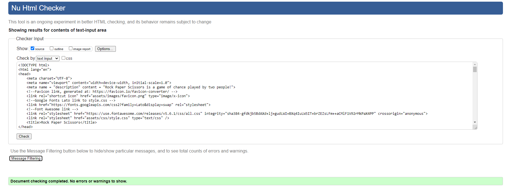
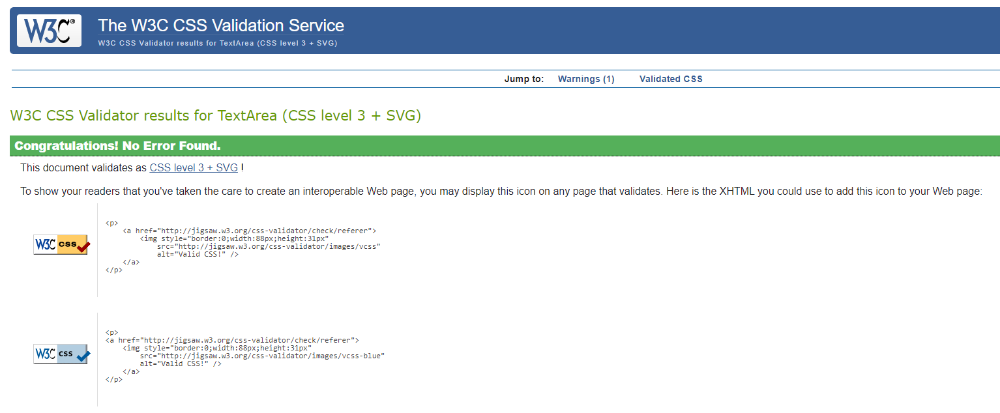
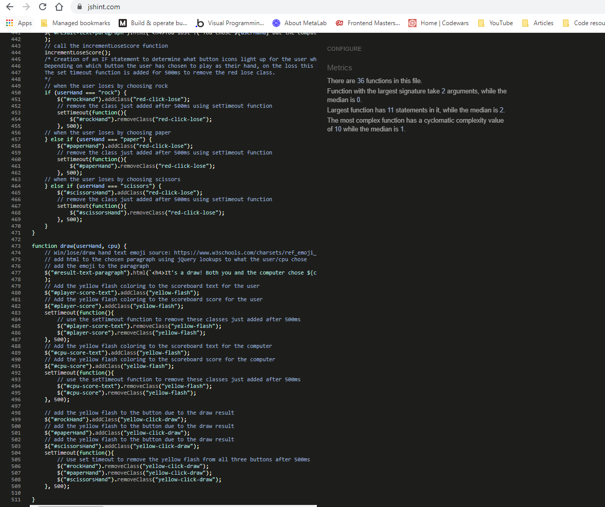
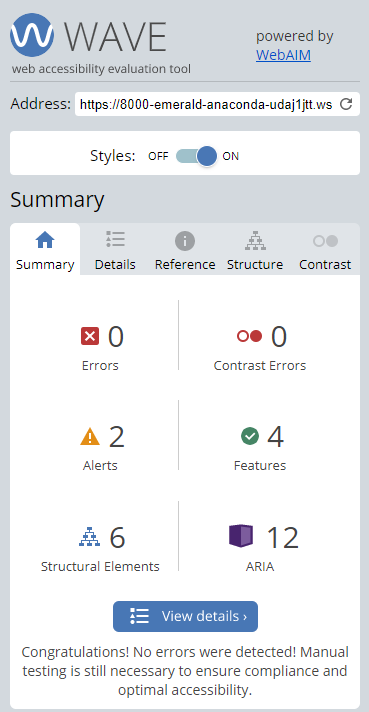
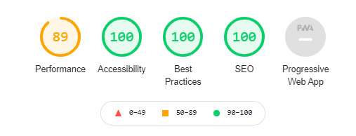
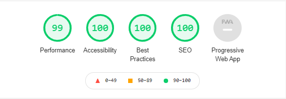
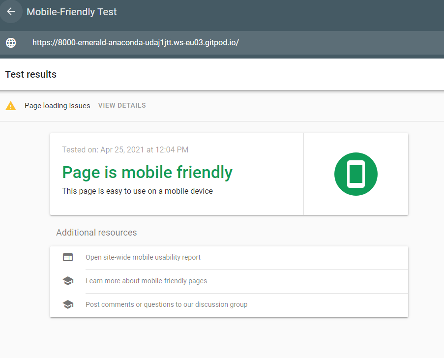

<h1 align = "center">Testing Results</h1>

# Code Testing

## W3C HTML Validator

## W3C CSS Validator

## JSHint Validator

# Accessibility Testing

## WAVE Web Accessibility Evaluation Tool

## Google Lighthouse

### Mobile

### Desktop

# Responsive Testing

## Google's Mobile Friendly Tester

